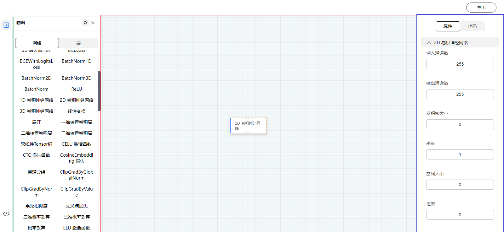

# dl-flow

dl-Flow 是一种拖拽式的线性网络搭建的 Web 应用程序。你可以使用该程序直观的搭建一个paddlepaddle的神经网络. 

## Quick Start

### Docker 搭建

我们非常推荐您使用Docker进行部署. 这不仅可以让你快速的进行上手, 也可以让您再后续对接其他程序更加的方便快捷(例如 K8s).

```yaml
# docker-compose.yaml
services:
  mongodb:
    image: mongo
    ports:
      - 27018:27017
  redis:
    image: redis
    ports:
      - 6379:6379
  front:
    image: gaonengwww/dl-flow-frontend
    ports:
      - 80:80
    volumes:
      - ./nginx.conf:/etc/nginx/nginx.conf
  server:
    image: gaonengwww/dl-flow-backend
    ports:
      - 9000:9000
    environment:
      - DB_URL=mongodb://mongodb:27017/dl-flow # 数据库地址
      - REDIS_HOST=redis # redis地址 (必填)
      - REDIS_PORT=6379 # redis端口 (必填)
      - REDIS_DB=0 # redis数据库 (必填)
      - REDIS_PASSWORD="" # redis密码
      - JWT_EXPIRE_IN=1d # JWT 过期时间 (必填)
      - JWT_SIGN_ALGORITHM=RS256 # JWT签名算法, 要与密钥对符合, 例如密钥对是RSA 2048bit, 那么此处应该是 RS256 (必填)
      - JWT_PUB_KEY=./keys/pub.key # JWT 公钥 (必填)
      - JWT_PRI_KEY=./keys/pri.key # JWT 私钥 (必填)
      - PWD_SALT=salt # bcrypt 盐(必填)
      - PWD_SALT_LEN=12 # bcrypt 盐(必填)
    volumes: # 强烈将下述卷挂载到本地, 以避免数据丢失
      - ./public:/public # 代码生成暂存位置
      - ./keys:/keys # 密钥对存放位置
      - ./data:/data # bundle.json与install.lock 存放位置
      - ./examples:/examples # 示例文件夹
```

`Web-Ui` 使用nginx驱动, 接下来我们需要编写 `nginx.conf`

```conf
worker_processes auto;

events {
    worker_connections 1024;
}

http {
    include mime.types;
    default_type application/octet-stream;
    sendfile on;
    gzip on;
    server {
        listen 80;
        location / {
            root /usr/share/nginx/html;
            index index.html index.htm;
        }
        location ~ /endpoint/ {
            rewrite ^/endpoint/(.*)$ /$1 break; # 主要负责反代的rewrite, 否则发的是 http://server:9000/endpoint/
            proxy_pass http://server:9000;
        }
        location ~ /socket.io {
            proxy_pass http://server:9001;

            proxy_set_header X-Forwarded-For $proxy_add_x_forwarded_for;
            proxy_set_header Host $host;
            proxy_http_version 1.1;
            proxy_set_header Upgrade $http_upgrade;
            proxy_set_header Connection "upgrade";
        }

    }
}
```

```bash
docker compose up -d
```

接下来，您便可以访问 `http://localhost` 开始搭建


## 源码构建

```bash
git clone https://atomgit.com/opentiny/000003.git
# git clone git@atomgit.com:opentiny/000003.git
ls -al
# .github
# dl-flow-backend  // 后端
# dl-flow-frontend // WebUi
# dl-flow-example // 示例
# nginx.conf // 预设好的nginx文件
```

### 后端构建

后端采用的是`Nest.js`

```bash
cd dl-flow-backend
pnpm install
pnpm build 
node dist/main.js
```

### 前端构建

前端魔改自`TinyEngine`, 部署方式与`TinyEngine`大同小异.

```bash
cd dl-flow-frontend
pnpm install
pnpm build:plugin
pnpm build:prod
cd packages/design-core/dist
```

### 环境变量与含义

- DB_URL: 数据库链接地址 (必填)
- REDIS_HOST: redis地址 (必填)
- REDIS_PORT: redis端口 (必填)
- REDIS_DB: redis数据库 (必填)
- REDIS_PASSWORD: redis密码 (必填)
- JWT_EXPIRE_IN: JWT过期时间, 规则可参考[vercel/ms](https://github.com/vercel/ms) (必填)
- JWT_SIGN_ALGORITHM: JWT签名算法, 要与密钥对符合, 例如密钥对是RSA 2048bit, 那么此处应该是 RS256 (必填)
- JWT_PUB_KEY: JWT 公钥 (必填)
- JWT_PRI_KEY: JWT 私钥 (必填)
- ~~PWD_SALT: bcrypt 盐 (必填)~~
- PWD_SALT_LEN: bcrypt 盐长度

### Bug 反馈

如有bug与其他方面的疑问, 欢迎提交[issue](https://atomgit.com/opentiny/000003/issues)

## WebUi布局



绿色区域: 网络与layer选择区域
红色区域: 布局区域, 在绿色区域 单击需要的网络后会显示在红色布局区内
蓝色区域: 网络区域, 可以配置网络的一些属性(Covn2D 举例)

- 输入特征大小
- 输出特征大小 
- 卷积核大小等

注意, 您应当自行校验网络的配置项, 例如: 理论上卷积核大小为1是可以存在的，它也的确有一些作用，比如

- 升维/降维
- 增加非线性

但是**可以**这么做并不意味着它**适合**你的需求更不等同于**不存在运行时候错误**(比如维度错误)

## 结构

### 流程图

### Web UI

下图展示了项目与TinyEngine的差异文件

```
├── packages
    ├── canvas
    │   ├── src
    │   │   ├── components
    │   │   │   ├── container
    │   │   │   │   ├── AlgoNode.vue          // 创建的自定义节点
    │   │   │   │   ├── GroupNode.vue         // 组节点
    │   │   │   │   └── X6Canvas.vue          // x6容器
    ├── controller
    │   ├── src
    │   │   ├── useLayer.js                   // 自定义Layer的逻辑
    │   │   ├── useResource.js                // 数据请求逻辑
    │   │   ├── useSchema.js                  // schema逻辑
    │   │   ├── useVisitor.js                 // Python AST解析
    │   │   ├── useWS.js                      // socket.io的二次封装
    │   │   └── useX6.js                      // x6的一些逻辑封装
    ├── design-core
    │   ├── authentication.html
    │   ├── src
    │   │   ├── App.vue
    │   │   └── authentication               // 登陆页面
    │   │       └── src
    │   │           ├── App.vue
    │   │           ├── components
    │   │           │   ├── login.vue
    │   │           │   └── register.vue
    │   │           └── main.js
    ├── plugins
    │   ├── materials                       // 物料 (paddlepaddle的网络物料)
    │   │   └── src
    │   │       ├── Main.vue
    │   │       ├── layer
    │   │       │   └── main.vue
    │   │       └── networks
    │   │           └── main.vue
    │   └── schema                         // 传输给后端的schema的预览窗
    │       └── src
    │           └── Main.vue
    └── settings                          // 物料的Props设计页面
        ├── code
        │   └── src
        │       └── Main.vue
        └── props
            ├── index.js
            ├── package.json
            └── src
                ├── Main.vue
                └── components
                    ├── Empty.vue
                    ├── ParamAttr.vue
                    ├── enums.vue
                    ├── list.vue
                    └── property-setting.vue
```

### 后端

[参考](./dl-flow-backend/README.md)


### 为什么结束节点和开始节点必须只有一个

因为目前生成的是`Sequential`而不是`Layer`. 

`Layer`的确更加的灵活。但是问题也非常的显而易见。

我们设计的是又向无环图, 又向表明 A->B 是正确的，但是 B->A 是不一定的。假设有一幅图

```
    Start
      |
      v
   Node-1
      |
 -----+-----
 |    |    |
 V    V    V
END1 END2 END3
```

那么不管如何遍历最终节点，其实都是正确的。但在神经网络中，不同网络的运算顺序会有不同的结果。比如`先池化后卷积`和`先卷积后池化`的运算结果是不同的。进入训练阶段，训练结果也可能不同。这主要是因为函数的组合在某些条件下是不可交换的，我们也使用数学语言证明了这一点。详细可以参考[函数组合的交换性讨论](./dl-flow-backend/proof/函数组合的可交换性讨论.pdf)


## 前端流程图


## 源码阅读顺序

```
dl-flow-back >> README.md >> code-generate/README.md >> code-generate.gateway.ts >> code-generate.service.ts >> ast.service.ts 

dl-flow-frontend >> X6Canvas >> useX6 >> useSchma >> export
```